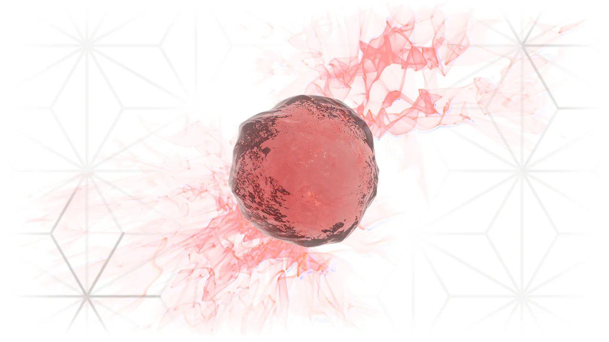

<a href="https://henryallen.xyz">
  <picture>
    <source media="(prefers-color-scheme: dark)" srcset=".github/banner-dark.webp">
    <source media="(prefers-color-scheme: light)" srcset=".github/banner-light.webp">
    
  </picture>
</a>

<h3 align="center"><a href="https://henryallen.xyz">I make computer graphics stuff</a></h3>
